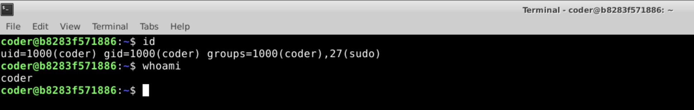
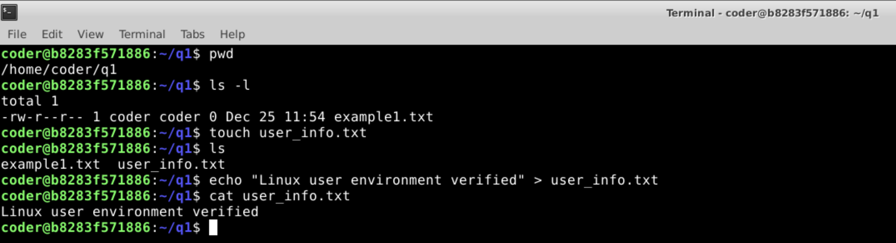
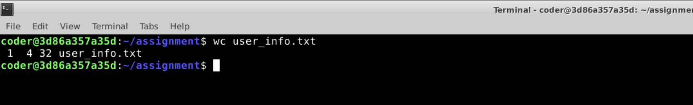
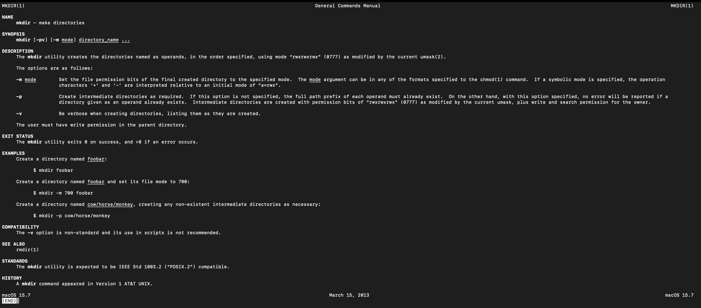
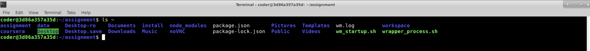
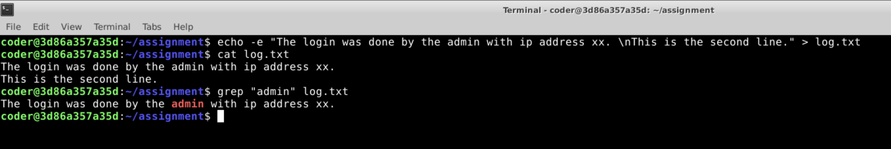
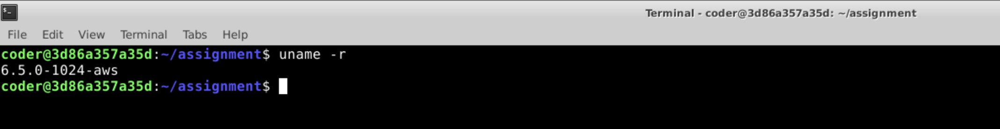
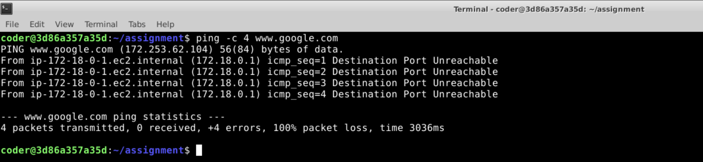
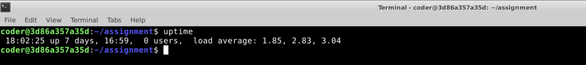

1. User Identity Verification

Command Used: id  

Output: uid=1000(coder) gid=1000(coder) groups=1000(coder),27(sudo)  

Explanation: I used the "id" command to get details about the username and id, the groups I belong to. I also verified the useris by typing whoami.  

Screenshot: 

----------------------------------------------------------------------------------------------------------------------------------------------------------------------------
    
2. Workspace Validation

a) Command used: pwd  

Ouput: /home/coder/q1  

b) Command used: ls -l  

Output: total 1  
-rw-r--r-- 1 coder coder 0 Dec 25 11:54 example1.txt  

Explanation: I used the "pwd" command to display the current working directory and "ls -l" to list the files in the present directory. While "ls" is used to list files, the "-l" option lists more details about it.  

Screenshot:   

----------------------------------------------------------------------------------------------------------------------------------------------------------------------------    

3. Environment Confirmation File

Commands used: touch user_info.txt
echo "Linux user environment verified" > user_info.txt  

Ouput: File was created and the content was copied.  

Explanation: I used the "touch" command to create a a file with (.txt) extension, and then used echo to print text into the txt file.

File Ouput:   

Screenshot:   

----------------------------------------------------------------------------------------------------------------------------------------------------------------------------

4. File Integrity Check

Command used: wc user_info.text  

Output: 1  4 32 user_info.text  

Explanation: I used the "wc" command to get the word count. It gave me 4 which is the number of words and 32 which is the number of characters.  

Screenshot:   

----------------------------------------------------------------------------------------------------------------------------------------------------------------------------

5. Learning the Tools

Command used: man mkdir  

Output Screenshot:   

Explanation: The coursera terminal had the minimal installation and hence I had used ios' version of the terminal.  
Option: -p. If we are trying to create a directory using a path and the intermediate path doesn't exist, the -p option creates the intermediary directories as well.

----------------------------------------------------------------------------------------------------------------------------------------------------------------------------

6. Home Directory Inspection

Command used: ls ~  

Output Screenshot:   

Explanation: I used the "ls" command to list files. Since the home directory's path had to be listed, I used ~ as the path. The files and directories are arranged alphabetically by default.  

----------------------------------------------------------------------------------------------------------------------------------------------------------------------------

7. Log Investigation

Command used: grep "admin" user_info.text  

Ouput Screenshot:    

Explanation: I used the "grep" command with my search term admin to look for lines with admin in the file user_infor.text. The ouput was the first line that had admin with the word covered in red.  

----------------------------------------------------------------------------------------------------------------------------------------------------------------------------

8. System Information Check

Command used: uname -r  

Output: 6.5.0-1024-aws  

Screenshot:   

Explanation: I used the "uname" command which gives the unix name. With the "-r" option, I was also able to get the release.  

----------------------------------------------------------------------------------------------------------------------------------------------------------------------------

9. Network Connectivity Test

Command used: ping -c 4 www.google.com  

Ouput Screenshot:   

Explanation: I used the ping to send packets to google.com. Since it would continuously send pings, I used the -c option to limit the number of pings to 4.  

----------------------------------------------------------------------------------------------------------------------------------------------------------------------------

10. System Health Awareness

Command used: uptime  

Output: 18:02:25 up 7 days, 16:59, 0 users, load average: 1.85, 2.83, 3.04  

Screenshot:   

Explanation: I used "uptime". The first part - 18:02:25 gives the current time of the system.  
up 7 days, 16:59 tells how long the system has been running  
The next part gives the number of users, which is 0 in this case  
The last part tells the avergae load on the system for the last 1 minute (1.85), 5 minutes (2.83) and 15 minutes (3.04)  

----------------------------------------------------------------------------------------------------------------------------------------------------------------------------

