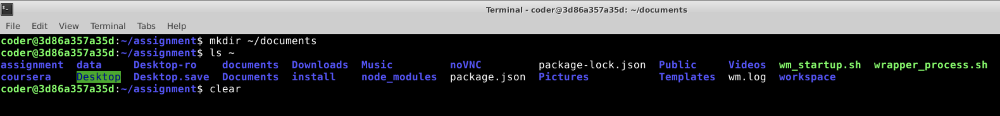
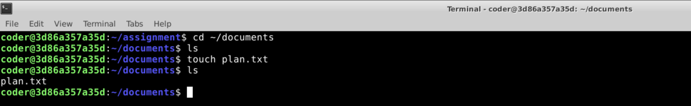
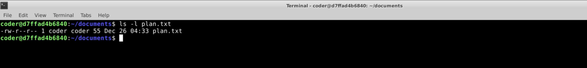
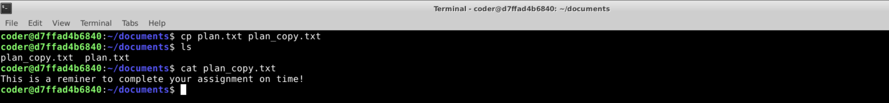
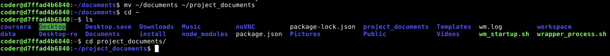
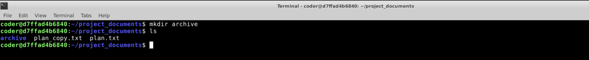
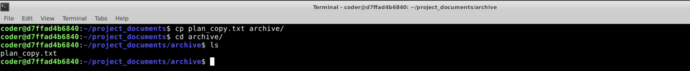
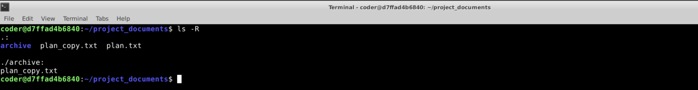
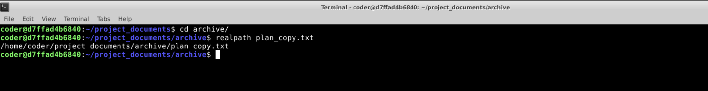

1. Project Workspace Setup

Command Used: mkdir ~/documents  

Output Screenshot: 

Explanation: I used the "mkdir" command to create the documents directory. I used the path ~ to create it in the home directory.  

----------------------------------------------------------------------------------------------------------------------------------------------------------------------------

2. File Creation

Commands Used: cd ~/documents  
touch plan.txt  

Output Screenshot:   

Explanation: I used "cd" with the path ~/documents to enter the directory. And the used "touch" with the file name to create the file.  

----------------------------------------------------------------------------------------------------------------------------------------------------------------------------

3. Content Addition

Commands Used: echo "This is a reminder to complete your assignment on time!" > plan.txt  

Output Screenshot:    

Text File:   

Explanation: I used the echo command to write the text of my choice, and used > symbol to write it into the file.  

----------------------------------------------------------------------------------------------------------------------------------------------------------------------------

4. File Metadata Verification

Command Used: ls -l plan.txt  

Output: -rw-r--r-- 1 coder coder 55 Dec 26 04:33 plan.txt  

Screenshot:   

Explanation: I used the "ls" command to list the files in the directory, and further used the -l command to list it with information like ownership, owner and groups.  

----------------------------------------------------------------------------------------------------------------------------------------------------------------------------

5. File Duplication  

Command Used: cp plan.txt plan_copy.txt  

Ouput Screenshot:   

Explanation: I used the cp command to copy the file - the first parameter - plan.txt was the input file and the seconf parameter - plan_copy.txt was the output file.  

----------------------------------------------------------------------------------------------------------------------------------------------------------------------------

6. Directory Renaming

Command used: mv ~/documents ~/project_documents  

Output Screenshot:    

Explanation: I used the mv command which is used to move files, and so can also be used to move  the file with a new name, essentially renaming the file. The first parameter is the input file and the second parameter is the new file name.  

----------------------------------------------------------------------------------------------------------------------------------------------------------------------------

7. Archival Structure

Command Used: mkdir ~/project_documents/archive  

Output Screenshot:     

Explanation: I went inside the project_documrnts directory and then used mkdir to create a new directory called acrhive.  

----------------------------------------------------------------------------------------------------------------------------------------------------------------------------

8. File Organization

Output: mv plan_copy.txt archive  

Output Screenshot:    

Explanation: I used the mv commad to move the file to archive folder. The first parameter is the file name and the second parameter is the destination folder.  

----------------------------------------------------------------------------------------------------------------------------------------------------------------------------

9. Recursive Listing

Command Used: ls -R  

Output Screenshot:   

Explanation: I used the ls command to list the files, but used -R to recursivel list all files within the subdirectories as well.

----------------------------------------------------------------------------------------------------------------------------------------------------------------------------

10. Path Verification

Command Used: realpath plan_copy.txt  

Output: /home/coder/project_documents/archive/plan_copy.txt

Screenshot:   

Explanation: I used the realpath command to get the absolute path of the plan_copt.txt present inside archive.
