1.  File Creation

Command Used: touch ~/sample_data.txt  
echo "This is a sample sentence" > ~/sample_data.txt  

Output Screenshot: 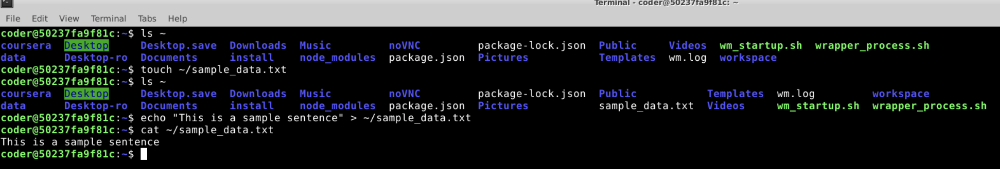

Explanation: I used the "touch" command to create a new txt file in home directory. I then used echo to write a sentence into the newly created file.  

----------------------------------------------------------------------------------------------------------------------------------------------------------------------------

2.  Hard Link Creation

Command Used: ln sample_data.txt sample_hard.txt  

Output Screenshot: 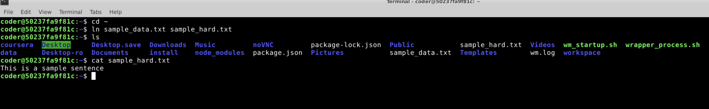

Explanation: I used the "ln" command to create a hard link. The first parameter was the name of the file for which I created the hard link, and the second was the link name.

----------------------------------------------------------------------------------------------------------------------------------------------------------------------------  

3.  Symbolic Link Creation

Command Used: ln -s sample_data.txt sample_soft.txt 

Output Screenshot: 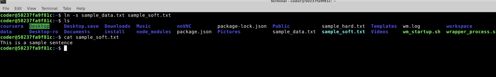

Explanation: I used the "ln" command with -s option to create a symbolic link. The first parameter was the name of the file for which I created the link, and the second was the link name.

----------------------------------------------------------------------------------------------------------------------------------------------------------------------------  

4. Inode Verification

Command Used: ls -li sample_data.txt sample_hard.txt sample_soft.txt

Output Screenshot: 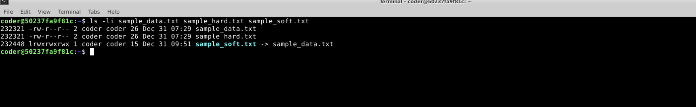

Explanation: I used the "ls" command with -li option to display inode numbers of files.  

----------------------------------------------------------------------------------------------------------------------------------------------------------------------------  

5. Inode Analysis

Explanation: The files sample_data.txt and sample_hard.txt have the inode numbers - which agrees with ourunderstanding that the hard link shares the same inode as the original file. The file, sample_soft.txt, being a soft link, has a different inode number.  

----------------------------------------------------------------------------------------------------------------------------------------------------------------------------  

6. File Metadata Inspection

Command Used: stat sample_data.txt  

Output Screenshot: 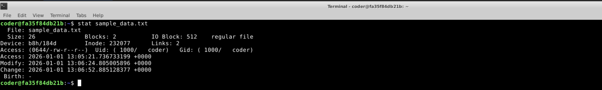

Explanation: I used the "stat" command to display detailed information about the file.  
It gave me information about the size, blcoks, IO block, accessm UID, GID and various timestamps (access, modify and change).

----------------------------------------------------------------------------------------------------------------------------------------------------------------------------  

7. Disk Usage Check

Command Used: du -sh ~  

Output: 9.7M /homr/coder

Output Screenshot: 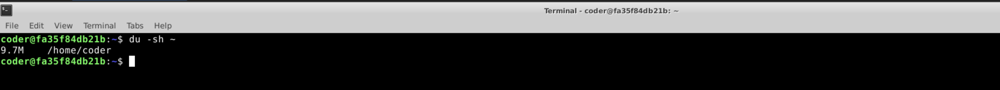

Explanation: I used the "du" command to display the disk usage. With that, I also used the -s (for summary) and -h (for human readable format).  

----------------------------------------------------------------------------------------------------------------------------------------------------------------------------  

8. File Size Overview

Command Used: ls -lh ~ 

Output Screenshot: 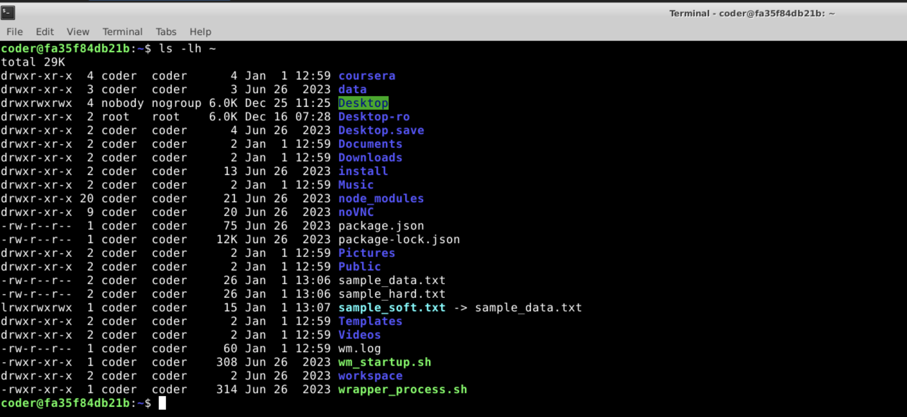

Explanation: I used the "ls" command with -lh parameter to display the details. The l paramenter helped me get the resutts in the form of a list, and the h parameter made it in a human readable format.  

----------------------------------------------------------------------------------------------------------------------------------------------------------------------------  

9. Link Deletion Test

Command Used: rm sample_soft.txt

Output Screenshot: 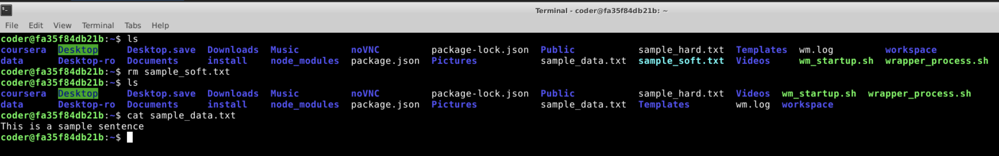

Explanation: I used the "rm" command on sample_soft.txt to delete the symbolic link. I then checked the original sample_data.txt and found out that the original file was unchanged.  
----------------------------------------------------------------------------------------------------------------------------------------------------------------------------  

10. Disk Utility Demonstration

Commands Used: df -h, df -T, df -i, du -sh, du -ah, du -hc 

Output Screenshot: 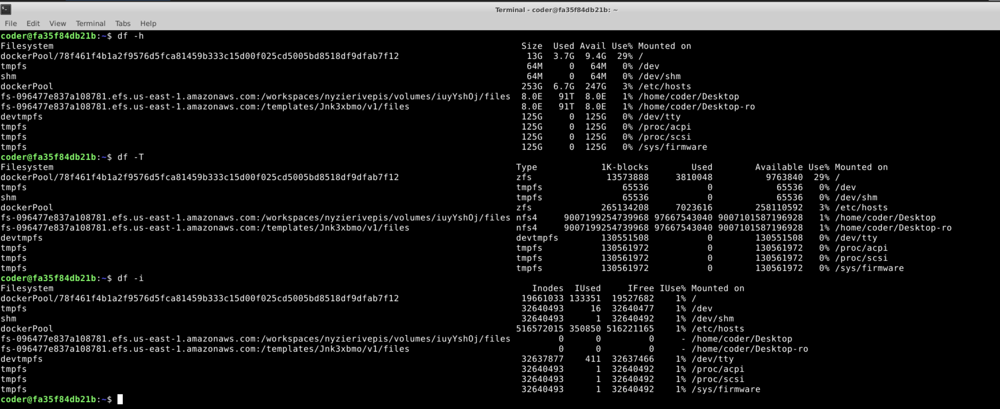  

  

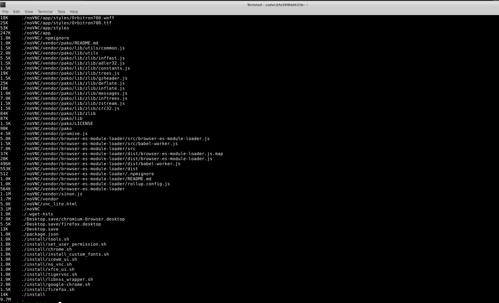  

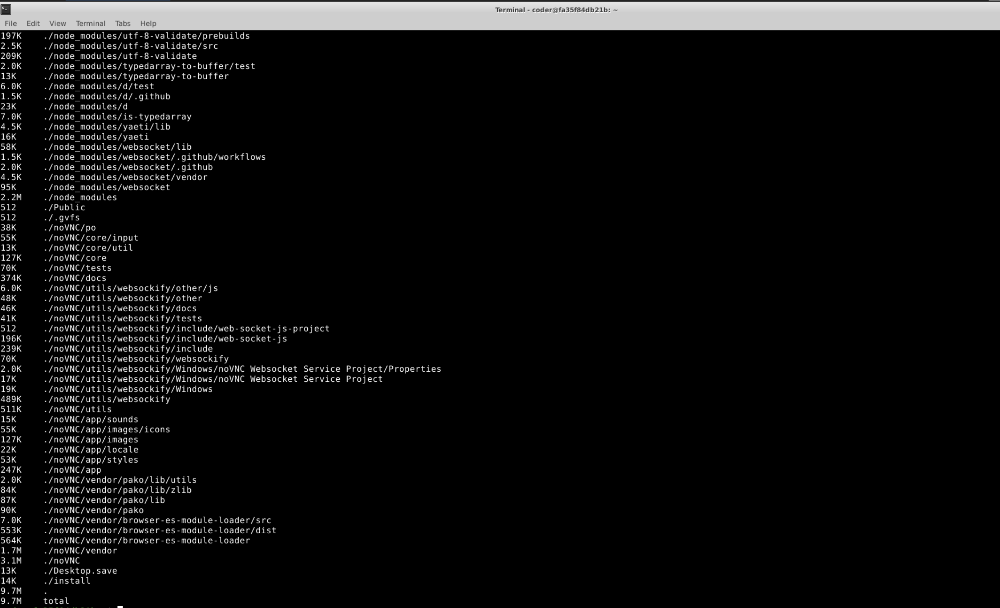

Explanation:  

df:
df gives the disk space available.
-h gives it in human readable format
-T shows the type of file system
-i gives the inode usgae  

du:  
du gives the disk usage  
-sh gives summary and in human readable format  
-ah gives all files and not just directories  
-hc gives total count at the bottom
