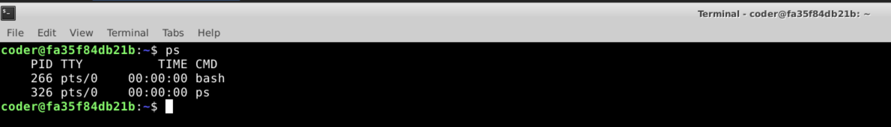
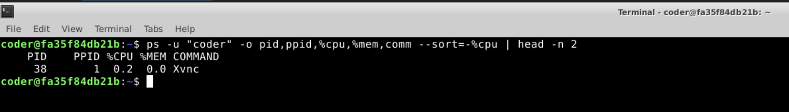
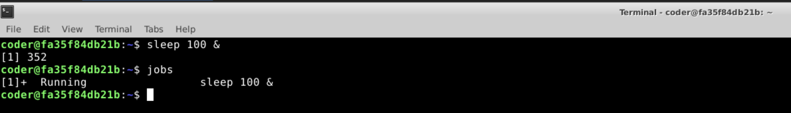
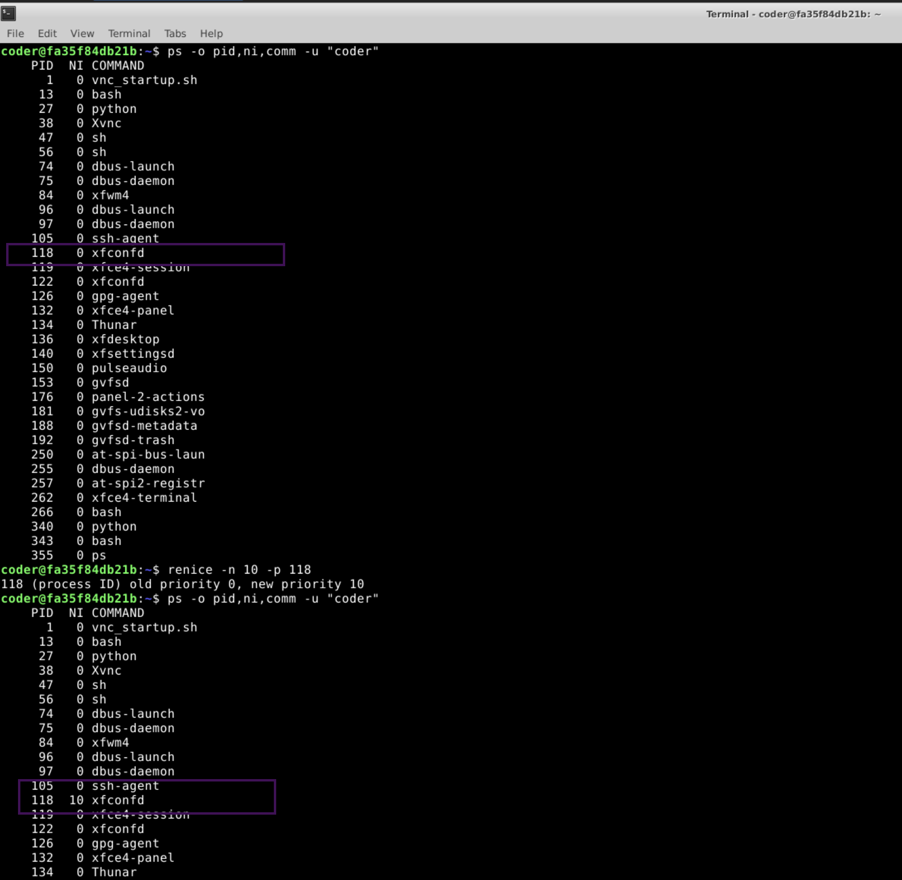
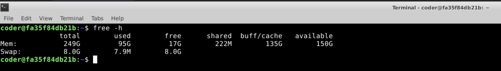
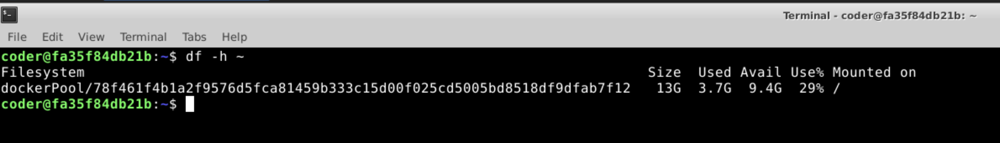
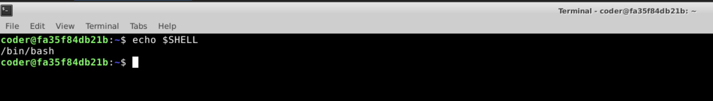
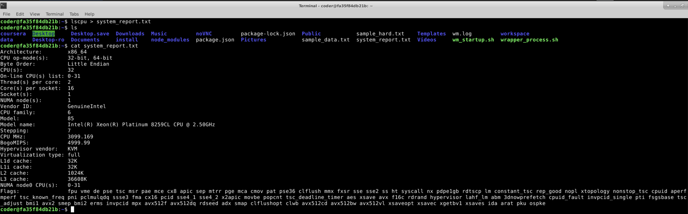

1.  System Uptime Verification

Command Used: uptime   

Output: 14:40:55 up 15 days, 21:37, 0 users, load average: 3.78, 3.55, 3.15

Output Screenshot: 

Explanation: I used the "uptime" command to display the time elapsed since last system boot.

----------------------------------------------------------------------------------------------------------------------------------------------------------------------------  

2.  User Process Listing

Command Used: ps   

Output Screenshot: 

Explanation: I used the "ps" command to display the processes running. There were two processes running for me - bash and ps.

----------------------------------------------------------------------------------------------------------------------------------------------------------------------------  

3.  CPU Usage Analysis

Command Used: ps -u "coder" -o pid,ppid,%cpu,%mem,comm --sort=-%cpu | head -n 2   

Output Screenshot: 

Explanation: I used the "ps" command to display the processes running. The -u parmeter helped me trim the list to specific users, coder in this case.  I used the -o command to display certain colmns. I used the --sort parameter to sort the tasks basis cpu usage, the - symbol helped me sort it in descending order. I used -n 2 to only display one process.

----------------------------------------------------------------------------------------------------------------------------------------------------------------------------  

4.  Background Process Execution

Command Used: sleep 100 &  
jobs

Output Screenshot: 

Explanation: As a sample command, I used sleep 100, so it runs for 100 seconds. The & parameter helped me run the process in the background. I then used the jobs command to display the running processes.
----------------------------------------------------------------------------------------------------------------------------------------------------------------------------  

5.  Process Priority Management

Command Used: ps -o pid,ppid,%cpu,%mem,comm -u "coder"  
renice -n 10 -p 118
ps -o pid,ppid,%cpu,%mem,comm -u "coder"

Output Screenshot: 

Explanation: I first used the ps command with -u to display all processes of my user, I then noted down a specific process, with pid 118, so I could change the priority. I then used renice command with n value to 10. I tne used the same command to display all processes again, this time I observed the priority value changes to 10.
----------------------------------------------------------------------------------------------------------------------------------------------------------------------------  

6.  Memory Usage Monitoring

Command Used: free -h

Output Screenshot: 

Explanation: I used the free command to dispaly the memory usage, and added -h parameter to display it in human readable format.
----------------------------------------------------------------------------------------------------------------------------------------------------------------------------  

7.  Disk Space Inspection

Command Used: df -h ~

Output Screenshot: 

Explanation: I used the df command to dispaly the disk space, and added -h parameter to display it in human readable format.
----------------------------------------------------------------------------------------------------------------------------------------------------------------------------  

8.  Shell Identification

Command Used: echo $SHELL  

Output: /bin/bash

Output Screenshot: 

Explanation: I used the echo command and displayed the value of $SHELL command which gave me the current shell - which was /bin/bash
----------------------------------------------------------------------------------------------------------------------------------------------------------------------------  

9.  Output Redirection

Command Used: lscpu > system_report.txt 

Output Screenshot: 

Explanation: I used the lscpu system command, and then used the > to send the output into the file system_report.txt
----------------------------------------------------------------------------------------------------------------------------------------------------------------------------  

10.  Disk Usage Visualization

Commands Used: ncdu  
ncdu ~  
ncdu -r  
ncdu -x  
ncdu -o filename  
ncdu -f filename  
ncdu --color dark

Explanation: I used the ncdu command to visualize disk visualization. Then used ~ to get the same for my home directory.  

I used the following parameters.  
-r read-only mode  
-x sca the current filesystem only  
-o export the result to a text file  
-f opens a previously saved scanned file without re-scanning the disk  
--color applies a color scheme
----------------------------------------------------------------------------------------------------------------------------------------------------------------------------

